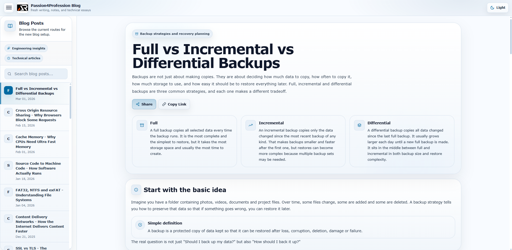

# Passion4Profession Blog

Modern blog repository for new articles and knowledge notes published under the Passion4Profession project.

---



---

This repository contains fresh blog posts covering computing fundamentals, internet technology, programming concepts, and thoughtful essays related to technology and learning.

The goal of this project is to build a clean and structured knowledge archive that explains technical topics in a simple and accessible way.

---

## Project Background

The Passion4Profession ecosystem currently has three parts:

1. **Original Blog (Archive)**  
   https://passion4profession.blogspot.com/

2. **Refactored Archive Project**  
   https://github.com/a2rp/passion4profession-refactored

3. **New Blog Repository (This Repo)**  
   https://github.com/a2rp/passion4profession-blog

The original blog contains older articles written years ago.  
The refactored archive project rebuilds those articles with modern UI.

This repository focuses on **new writing and future articles**.

---

## Goals

The main goals of this project are:

- Write clear explanations of computing topics
- Preserve useful internet knowledge in a structured format
- Build a long-term technical knowledge archive
- Publish new blog posts regularly

Topics may include:

- Operating systems
- Programming concepts
- Networking fundamentals
- Internet technologies
- Software engineering ideas
- Computing history
- Learning and productivity

---

## Tech Stack

This project is built using:

- React
- Vite
- styled-components
- react-icons

Each topic is written as a separate component and structured to make concepts easy to explore.

---

## Running Locally

Clone the repository:

```bash
git clone https://github.com/a2rp/passion4profession-blog.git

Move into the project directory:
cd passion4profession-blog

Install dependencies:
npm install

Start the development server:
npm run dev

Build
To create a production build:
npm run build
```

---

## Follow Me

- GitHub https://github.com/a2rp
- Portfolio https://www.ashishranjan.net
- LinkedIn https://www.linkedin.com/in/aashishranjan
- Facebook https://www.facebook.com/theash.ashish/
- YouTube https://www.youtube.com/@ashishranjan-ashz

---

a2rp - an Ashish Ranjan presentation
