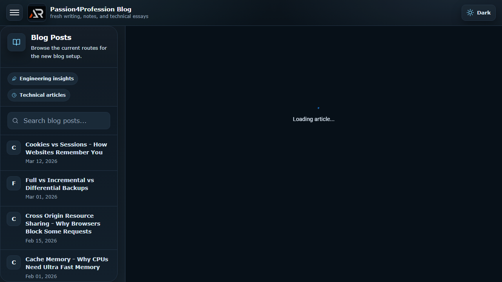

# Passion4Profession Blog

A React and Vite knowledge blog for clear technical essays, computing notes, and practical learning resources.

## Features

- Searchable blog archive with date-aware post navigation
- Lazy-loaded routes for technical articles
- Dark and light themes saved in local storage
- Responsive layout with mobile sidebar navigation
- Share controls, scroll-to-top control, and icon-only footer links
- Generated blog index files for maintainable content

## Tech stack

- React
- Vite
- React Router
- styled-components
- Material UI
- react-icons

## Run locally

\`\`\`bash
npm install
npm run dev
\`\`\`

Build and deploy:

\`\`\`bash
npm run build
npm run deploy
\`\`\`

## Live

[Open the Passion4Profession Blog](https://a2rp.github.io/passion4profession-blog/)

## Future scope

The blog can grow with more focused articles, topic filters, richer search, and improved reading progress tools.

## Links

- Portfolio: [ashishranjan.net](https://www.ashishranjan.net/)
- GitHub: [github.com/a2rp](https://github.com/a2rp)
- CodePen: [codepen.io/ash1198](https://codepen.io/ash1198)
- LinkedIn: [linkedin.com/in/aashishranjan](https://www.linkedin.com/in/aashishranjan)
- Facebook: [facebook.com/theash.ashish](https://www.facebook.com/theash.ashish/)
- YouTube: [youtube.com/@ashishranjan-ashz](https://www.youtube.com/@ashishranjan-ashz?sub_confirmation=1)
- Email: [ash.ranjan09@gmail.com](mailto:ash.ranjan09@gmail.com)

## Support

- Support: [a2rp-donation-page.netlify.app](https://a2rp-donation-page.netlify.app/)
- Buy Me a Coffee: [buymeacoffee.com/a2rp](https://buymeacoffee.com/a2rp)
- Patreon: [patreon.com/a2rp](https://www.patreon.com/a2rp)
